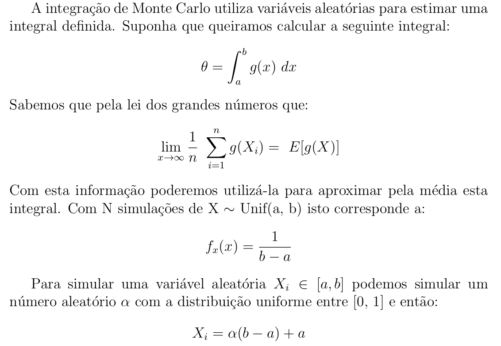
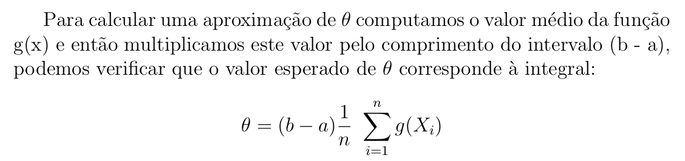
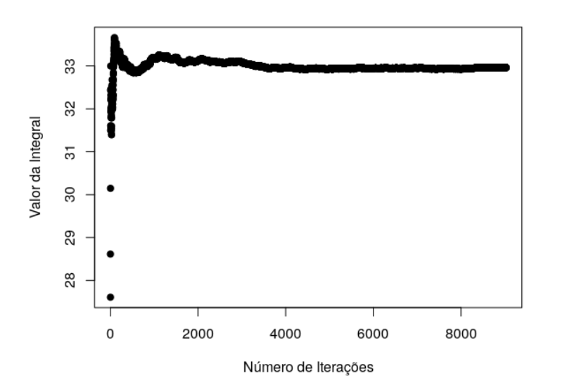

# Integração de Monte Carlo
Os métodos de Monte Carlo utilizam técnicas heurı́sticas para re-
solver diversos problemas comuns. Dentre eles o de integração numérica
que utiliza números aleatórios para calcular, principalmente, integrais
que não podem ser resolvidas analiticamente.\

\

## Visualização gráfica da convergência da integral

